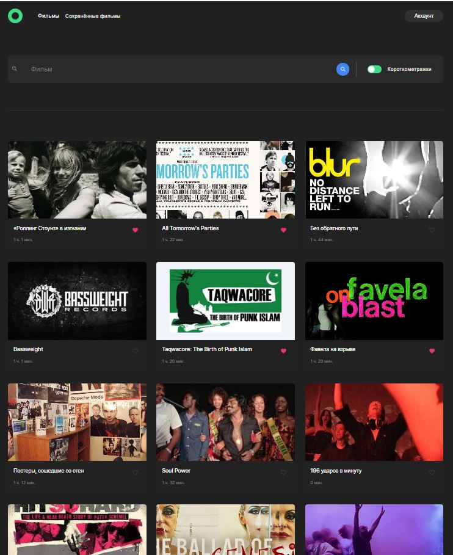
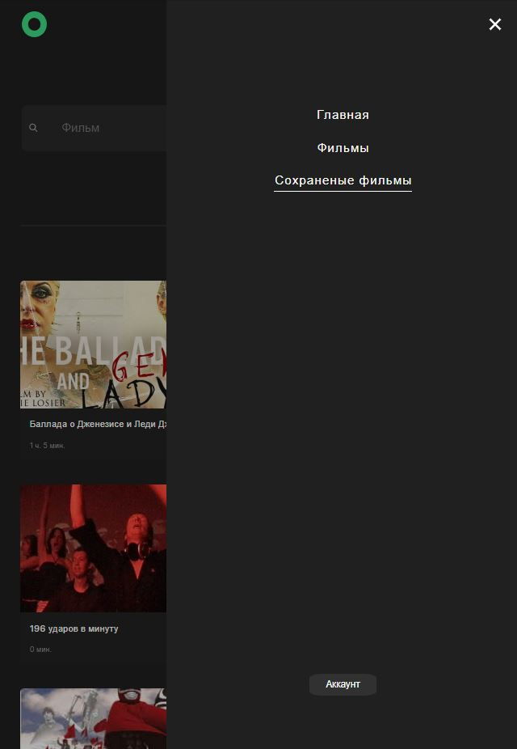

<h1 align="center">Movies-explorer</h1>

<table border="1">

  <tr>
    <th>Project</th>
    <th>Preview</th>
  </tr>

 <tr>
    <td>
      
<strong>Movie search application.</strong>
   
      
Diploma project developed during the course [Yandex.Practicum](https://practicum.yandex.ru/web/).

      
Tools: React, JavaScript, Flexbox, Grid Layout, Webpack, Html, CSS

      
The project has the following functions: 

      <ul>
        <li>Layout according to BEM methodology;</li>
        <li>Adaptability at different resolutions - 1280px, 1024px, 768px, 320px, including breakpoints;</li>
        <li>Using grid and flex technologies;</li>
        <li>User authorization and registration, editing user data;</li>
        <li>Search for movies, add and delete movies to favorites;</li>        
      </ul>
      
The result <a href="https://diplomov.nomoreparties.sbs/" target="_blank">here</a> or you can click on the image on the right.

      
* * *

      
<strong>Приложение, в котором пользователи могут искать фильмы по ключевым словам и добавлять их в избранное в личном кабинете.</strong>

      
Дипломный проект был разработан в рамках курса [Яндекс.Практикум](https://practicum.yandex.ru/web/)

      
Функционал:

      <ul>
        <li>Авторизация и регистрация пользователей;</li>
        <li>Редактирование профиля;</li>
        <li>Поиск фильмов по ключевым словам;</li>
        <li>Возможность добавлять фильмы в избранное.</li>        
      </ul>
      
Стек технологий: HTML5; CSS3; Методология БЭМ; JavaScript; Webpack; React JS.

      
Ссылка на макет: https://disk.yandex.ru/d/N81yTKku_3rL-Q
  
    </td>
    <td>
      
Click preview

      
      
* * *

      
    </td>
  </tr>

  </table>
